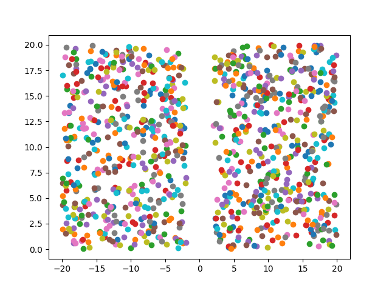

=====
About
=====

This is a demo of unsupervised learning where I try to cluster
(x, y) coordinates.
The problem is very similar to
`this one <http://povilasb.com/misc/machine_learning_intro.html>`_.
Except right now I have a bunch of unlabeled coordinates that I want to
cluster::

        o        ^
            o    |
          o      |
                 |
                 |
                 |
                 |
                 |    x
                 |       x
                 |  x
     ------------+------------->

K-Means clustering algorithm was used [#f3]_.

Data
====

There's a script to generate random data::

    $ pyenv/bin/python3 src/generate_data.py --help
    Usage: generate_data.py [OPTIONS]

    Options:
      --samples INTEGER  Number of generated data samples.
      --output TEXT      File to write json data to.
      --help             Show this message and exit.

For example to generate 10000 samples and save the data to out.json use
this command::

    $ pyenv/bin/python3 src/generate_data.py --samples 10000 --output vectors.json

Currently it generates two clusters split by Y axis. But in theory any kind
of generators could be implemented that generate more clusters and with
different functions.

Visualization
-------------

There's another script to visualize data::

    $ pyenv/bin/python3 src/plot_data.py --help
    Usage: plot_data.py [OPTIONS]

    Options:
      --in TEXT   Input data file path.
      --out TEXT  Output image file.
      --help      Show this message and exit.

For example to save a visualized `vectors.json` file to svg image use this
command::

    $ pyenv/bin/python3 src/plot_data.py --in vectors.json --out data.svg

Data generated with `PointsSplitByYAxis` generator looks like this:

Samples
=======

See `src/main.py` how K-Means clustering is used.

Run the samples::

    $ make pyenv # create python virtual environment with dependencies
    $ pyenv/bin/python3 src/gen_data.py # generate some sample data
    $ pyenv/bin/python3 src/main.py # classify the data

Development
===========

There are some utilities to ensure code quality and correctness.

Run tests::

    $ make test

Validate PEP8 formatting::

    $ make lint

.. rubric:: References

.. [#f1] http://scikit-learn.org/stable/tutorial/statistical_inference/unsupervised_learning.html
.. [#f2] https://www.youtube.com/watch?v=7Qv0cmJ6FsI
.. [#f3] http://bigdata-madesimple.com/possibly-the-simplest-way-to-explain-k-means-algorithm/
